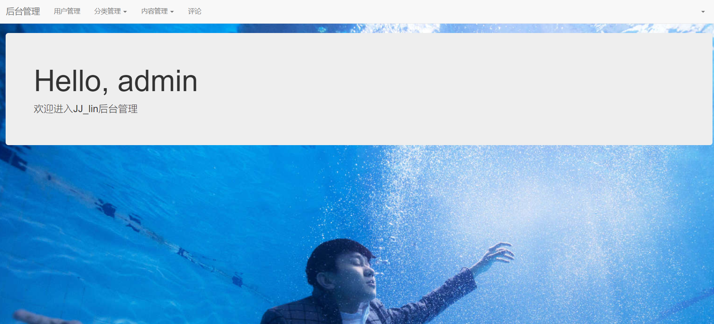
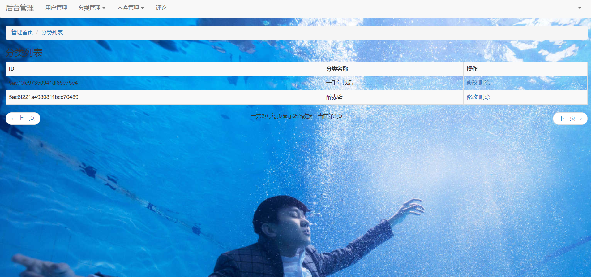
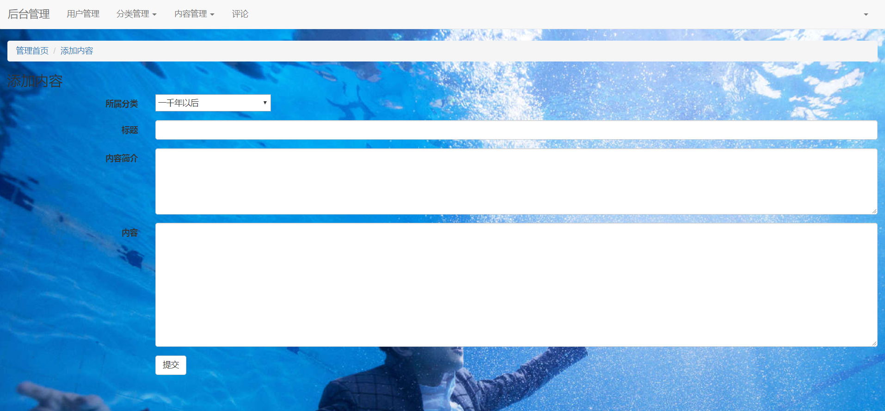

# node-blog（如果对你有帮助点右上角star，谢谢啦）
使用Node+mongodb数据库 创建的博客后台
最近学习node开发，写了一个demo博客管理后台。

## 参与开发
 
更多项目请关注 https://github.com/fanfan1993
 

### 下载到本地运行须知
1. 下载后要在本地运行请先
    npm install  
2. 数据库用的Mongodb，需创建blog数据库，数据库结构表schemas在目录下
3. 创建db的文件夹

### 页面效果
##### 前台显示

##### 后台首页

##### 后台内容列表

##### 后台内容添加

